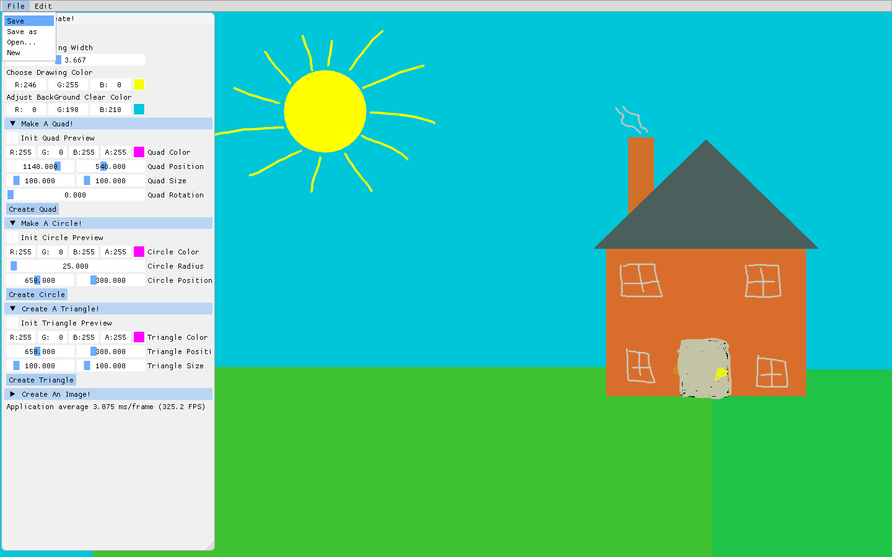

# Canvas
Canvas is a 2D drawing app designed for average computer users who just need to simply draw over an image, make a custom shape, or want to draw a pretty picture. 
Canvas supports drawing with any color, drawing squares, circles, triangles, and any arbituary shape. Canvas also supports image loading for including
images in the drawing. The user can save their creation as a png image. 

Canvas is made using my custom graphics library, AP2DGL.

